L'Essence — Luxury Perfumes E-Commerce 🌟


**Live Demo:** [https://com2-65de5.web.app](https://com2-65de5.web.app)

L'Essence is a premium, fully-localized e-commerce platform specifically tailored for the Algerian luxury Perfumes market. Built with modern web technologies, it features a sophisticated "Liquid Glass" design aesthetic, a comprehensive administration dashboard, and a highly secure integration with local delivery couriers (Yalidine, Maystro, Ecotrack, etc.).

## ✨ Key Features

### 🛍️ Premium Customer Experience
- **"Liquid Glass" UI/UX:** A modern, high-end design featuring glassmorphism, smooth animations, and a dynamic Ken Burns hero carousel.
- Sample : 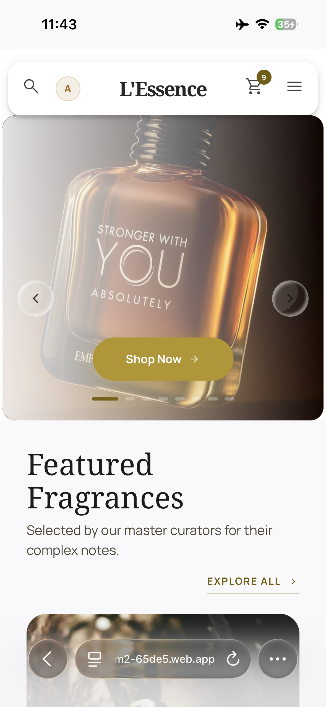
- 
- 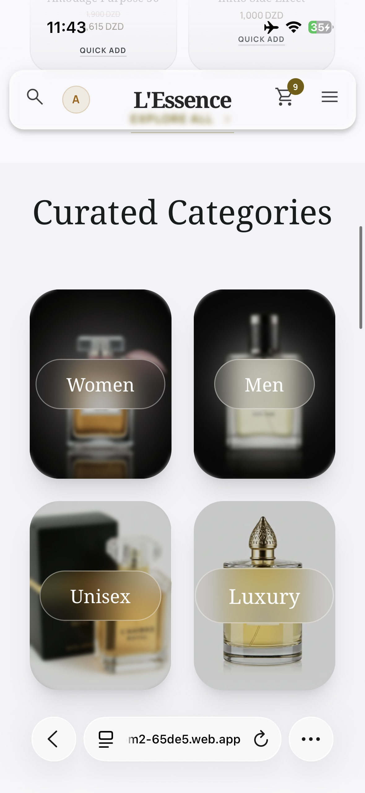
- 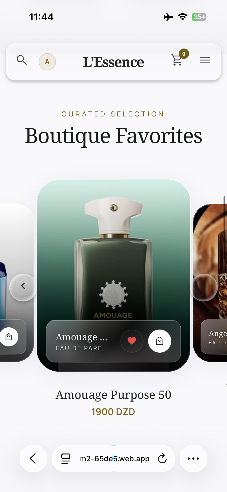
- 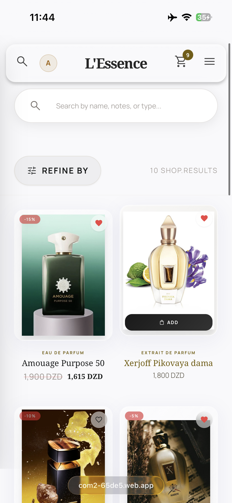

- 
- **Multi-Language Support:** Fully localized interface with seamless switching between English, French, and Arabic (RTL support).
- **Smart Checkout:** Automatically calculates shipping rates based on the customer's Wilaya and dynamically pulls available StopDesk pickup points.
- **Order Tracking:** Customers can track their orders in real-time.
- - 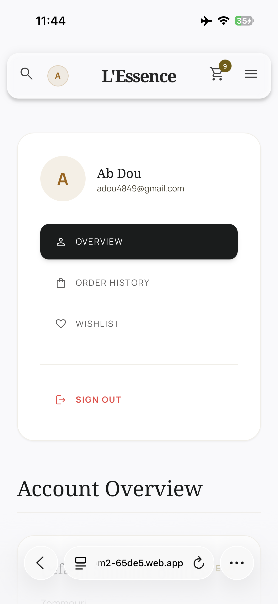


### 🛡️ Secure Backend Architecture
- **Firebase Cloud Functions Proxy:** All shipping API requests (creating orders, fetching rates, getting labels) are proxied through server-side Cloud Functions. This entirely hides sensitive API keys from the frontend and completely prevents CORS errors.
- **Automated Webhooks:** Listens to silent POST webhooks from couriers to automatically update order statuses (e.g., from "Shipped" to "Delivered") in the database.
- **Cloud Database & Auth:** Utilizes Firebase Firestore for real-time data sync and Firebase Auth for secure user accounts.

### 📊 Powerful Admin Dashboard
- **Product Management:** Full CRUD capabilities for fragrances, including stock, pricing, fragrance notes, and ImgBB image uploads.
- **Order Processing:** Admins can view orders, print official courier shipping labels, and dispatch orders to couriers with a single click.
- **Dynamic Content Control:** Admins can customize the Hero Carousel, curated categories, and featured products directly from the UI without touching code.
- **Shipping Configuration:** Easily switch between different Algerian couriers and sync live shipping rates directly into the database.

- ##Dashboard Sample :

- - 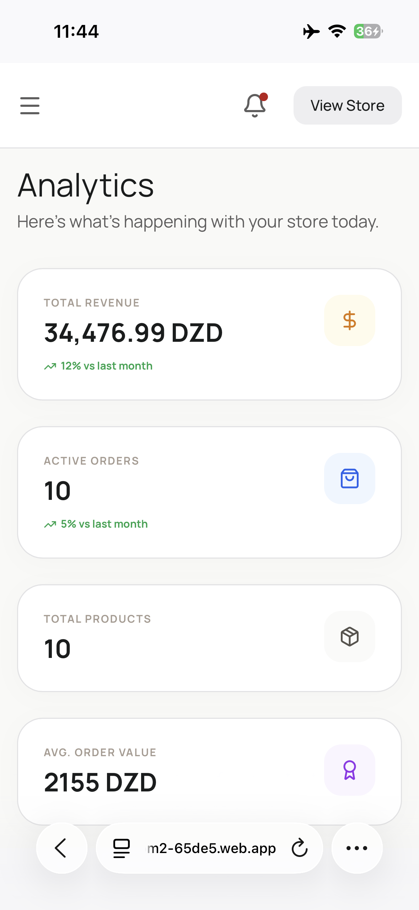
- 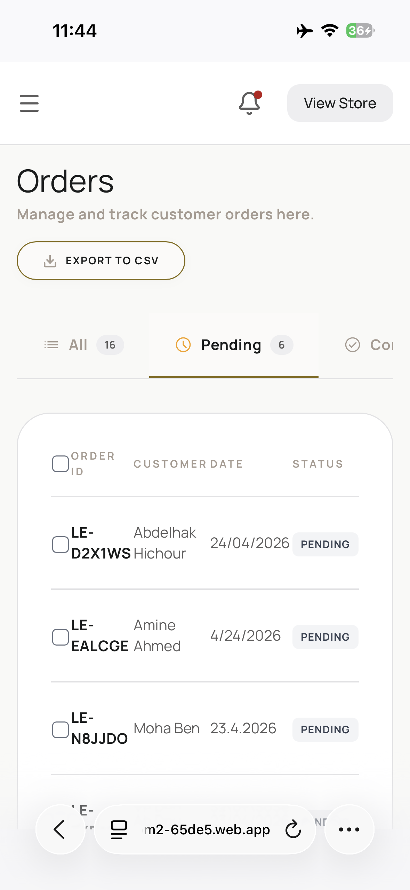
- 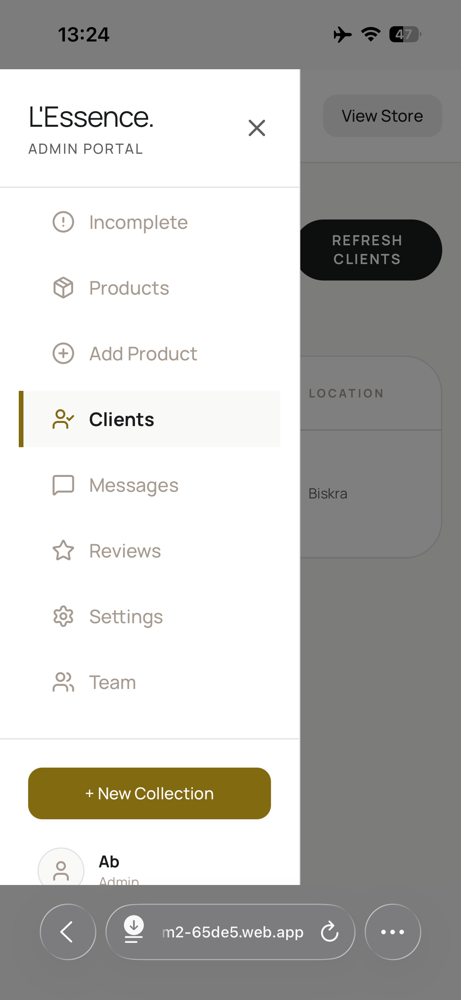
- 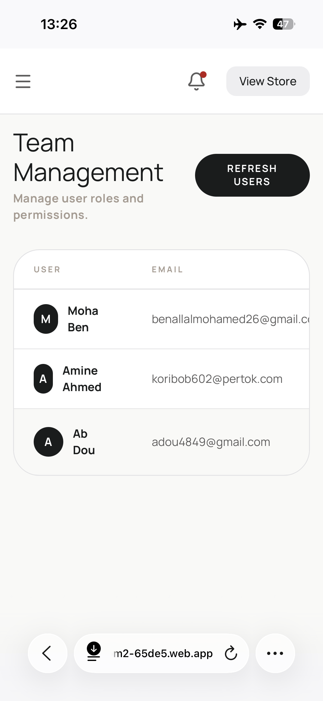

- 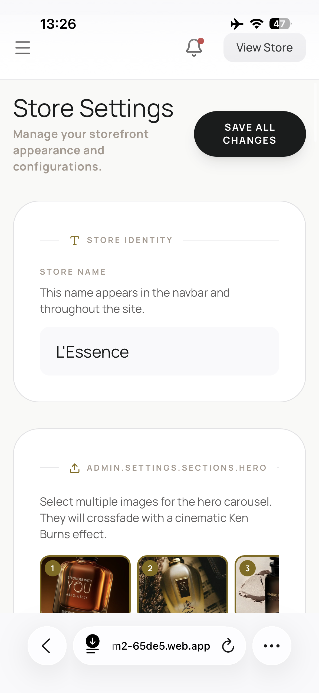
- 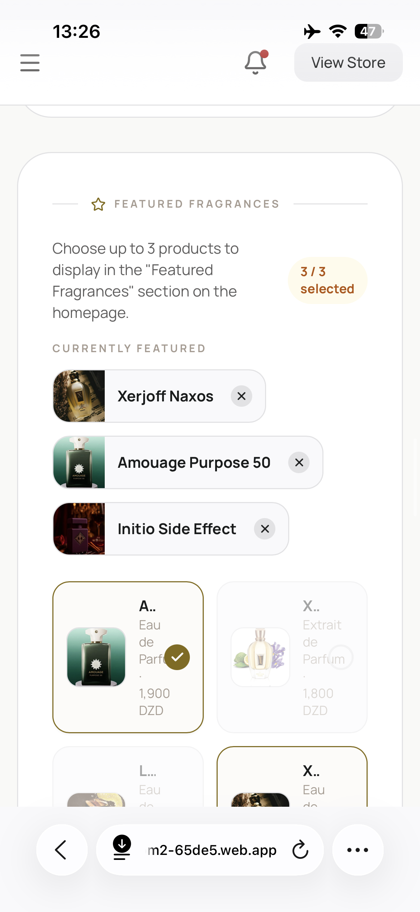


## 🛠️ Technology Stack

- **Frontend:** React.js, Vite, TailwindCSS
- **State Management:** React Context API
- **Backend/BaaS:** Firebase (Auth, Firestore, Cloud Functions, Hosting)
- **Image Hosting:** ImgBB API
- **Animations:** Framer Motion
- **Icons:** Lucide React & Google Material Symbols

## 🚀 Getting Started

### Prerequisites
- Node.js (v18+)
- Firebase CLI (`npm install -g firebase-tools`)
- A Firebase Project (with Firestore and Auth enabled)

### Installation

1. **Clone the repository:**
   ```bash
   git clone https://github.com/yourusername/lessence-luxury-perfumes.git
   cd lessence-luxury-perfumes
   ```

2. **Install dependencies:**
   ```bash
   npm install
   ```

3. **Set up environment variables:**
   Create a `.env` file in the root directory and add your Firebase and ImgBB credentials:
   ```env
   VITE_FIREBASE_API_KEY=your_api_key
   VITE_FIREBASE_AUTH_DOMAIN=your_auth_domain
   VITE_FIREBASE_PROJECT_ID=your_project_id
   VITE_FIREBASE_STORAGE_BUCKET=your_storage_bucket
   VITE_FIREBASE_MESSAGING_SENDER_ID=your_messaging_sender_id
   VITE_FIREBASE_APP_ID=your_app_id
   VITE_IMGBB_API_KEY=your_imgbb_api_key
   ```

4. **Run the development server:**
   ```bash
   npm run dev
   ```

### Deploying Cloud Functions
To ensure the shipping API proxy works securely:
```bash
cd cloud-functions-source
npm install
firebase deploy --only functions
```

## 📄 License

This project is available for:

✔ Personal use  
✔ Learning and educational purposes  
✔ Modification and customization  
✔ Use in personal or client projects  

You are allowed to:
- Use the code freely
- Modify it
- Build your own version for your own business

You are NOT allowed to:
- Resell or redistribute this project as a template or product
- Claim the original work as your own
- Re-upload it as a competing commercial starter kit

- ## 📬 Contact

- Email: hichourabdelhak1@gmail.com  
- GitHub: https://github.com/abdouh071  

---


- ## ⭐ Final Note

This project represents a practical implementation of a real-world e-commerce system focused on usability, performance, and scalability.

If you found it useful, feel free to ⭐ the repository 

© 2024 L'Essence — All rights reserved
